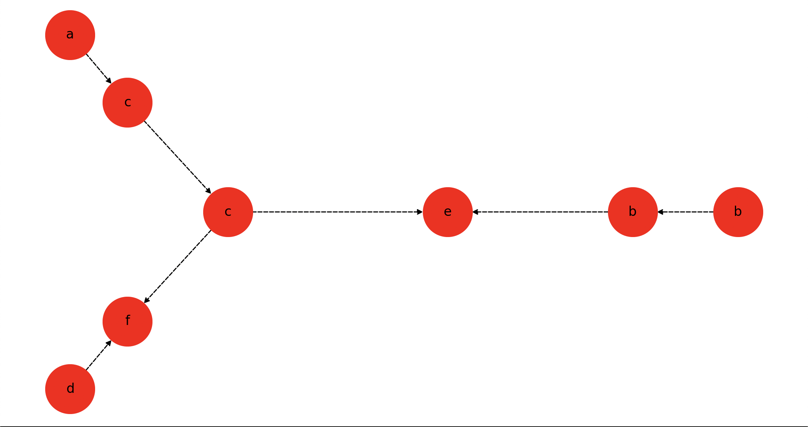
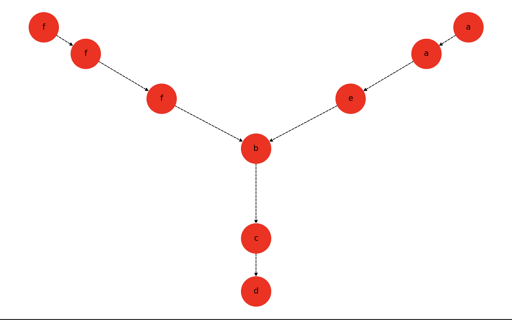
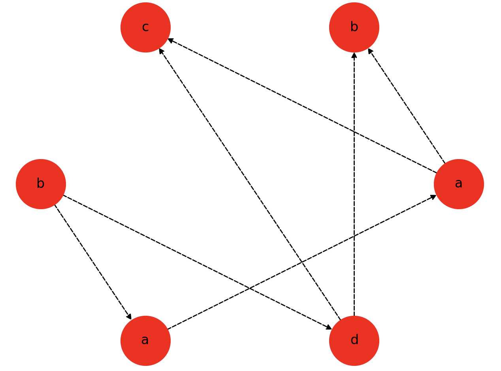

# Report
#### Author: Maciej Makowski

## Setup

1. Create and activate a virtual environment:

    ```sh
    $ python3 -m venv .venv && source venv/bin/activate
    ```

2. Install the requirements:

    ```sh
    (.venv) $ pip install -r requirements.txt
    ```

3. Run program

    ```sh
    (.venv) $ python3 solution.py
    ```


## Code

##### 1. Reading input data from file
Output:
- transactions - set of variables transactions as dictionary(keys - letters, values list of left-side varibale and set of right-side variables)
- A - alphabet as list of characters
- w - word(some actions sequence) as string
```py
def read_input_from_file(file_path):
    transactions = dict()
    A = list()
    w = ""
    try:
        with open(file_path, 'r') as file:
            for line in file:
                line = line.strip()
                if line.startswith("("):
                    letter = None
                    left_side = None
                    right_side = set()
                    for c in line:
                        if c.isalpha():
                            if letter is None:
                                letter = c
                            elif left_side is None:
                                left_side = c
                            else:
                                right_side.add(c)

                    transactions[letter] = [left_side, right_side]
                        
                elif line.startswith("A"):
                    for c in line[1:]:
                        if c.isalpha():
                            A.append(c)
                elif line.startswith("w"):
                    for c in line[1:]:
                        if c.isalpha():
                            w += c
    except FileNotFoundError:
        print("file does not exist.")
    except IOError:
        print("I/O error occurred.")

    return transactions, A, w
```

```
expected file format:

(a) x := x + 1
(b) y := y + 2z
(c) x := 3x + z
(d) w := w + v
(e) z := y - z
(f) v := x + v
A = {a, b, c, d, e, f}
w = acdcfbbe
```

##### 2. Calculating dependency and independency relation
Output:
- D - dependecies list as set of tuples
- I - independecies list as set of tuples

How it works:
- We checks all pairs of actions and define if we can do them concurrently (we can not if one of them modifies some variable and the other reads or modifies that variable).

```py
def get_dependency_and_independancy_relations(transactions, A):
    D = {(x, x) for x in A}
    I = set()

    for i in range(len(A)):
        for j in range(i+1, len(A)):
            x = A[i]
            y = A[j]
            
            if transactions[x][0] in transactions[y][1] or transactions[y][0] in transactions[x][1]:
                D.add((x, y))
                D.add((y, x))
            else:
                I.add((x, y))
                I.add((y, x))

    return D, I
```

##### 3. Calculating Foata's normal form
Output:
- foata_form - Foata's normal form as list of lists of characters

How it works:
- For all actions from word we checking if action is dependent to any of actions from recent added 'independent' block. If yes we add that block to lists representing Foata's form and initialize new current block with this action, if not we are trying to find block with the lowest index which is independent with this action (all actions from block are independent with current action).
- After that process we obtain the result.

```py
def get_foata_normal_form(D, w):
    foata_form = []
    current_block = set()

    for letter in w:
        if any((letter, l) in D for l in current_block):
            foata_form.append(current_block)
            current_block = {letter}
        else:
            block_to_be_added = current_block
            for block in reversed(foata_form):
                if not any((letter, l) in D for l in block):
                    block_to_be_added = block
                
            block_to_be_added.add(letter)

    if current_block:
        foata_form.append(current_block)
    
    foata_form = [sorted(block) for block in foata_form]

    return foata_form
```

##### 4. Creating and drawing graph

How it works:
- We create graph using ```create_graph(foata_form, D)```, which finds edges using similar logic to ```get_foata_normal_form(D, w)```.
- Then we draw that graph using ```mathplotlib``` and ```networkx```

Output:
- G - graph represented as adjacency list
```py
def create_graph(foata_form, D):
    G = [[] for _ in range(len([x for y in foata_form for x in y]))]
    index = 0
    for block in foata_form:
        for i in range(len(block)):
            block[i] = (index, block[i])
            index += 1
            
    for i in range(len(foata_form)-1, -1, -1):
        for v in foata_form[i]:
            for j in range(i + 1, len(foata_form)):
                for u in foata_form[j]:
                    if (v[1], u[1]) in D:
                        if j == i + 1:
                            G[v[0]].append(u[0])
                        else:
                            if not are_connected(v[0], u[0], G):
                                G[v[0]].append(u[0])   

    return G
```
```py
#Helper function, which checks if two verticies are connected
def are_connected(s, u, G):
    for v in G[s]:
        if v == u:
            return True
        elif are_connected(v, u, G):
            return True
    return False
```

```py
def draw_graph(foata_form, D):
    vertices = [x for y in foata_form for x in y]
    label_mapping = {i: v for i, v in enumerate(vertices)}

    graph = create_graph(foata_form, D)

    G = nx.DiGraph()

    for v in label_mapping.keys():
        G.add_node(v)

    for v in range(len(graph)):
        for u in graph[v]:
            G.add_edge(v,u)

    pos = nx.spring_layout(G) # you can change graph positioning (spectral_layout, circular_layout, shell_layout, spring_layout)
    nx.draw(G, with_labels=True, labels=label_mapping, node_size=2000, node_color='red', style='dashed', pos=pos)
    plt.show()
```

## Example of usage

#### Case 1

Input file:
```txt
(a) x := x + 1
(b) y := y + 2z
(c) x := 3x + z
(d) w := w + v
(e) z := y - z
(f) v := x + v
A = {a, b, c, d, e, f}
w = acdcfbbe
```

Output:
```
D:  [('a', 'a'), ('a', 'c'), ('a', 'f'), ('b', 'b'), ('b', 'e'), ('c', 'a'), ('c', 'c'), ('c', 'e'), ('c', 'f'), ('d', 'd'), ('d', 'f'), ('e', 'b'), ('e', 'c'), ('e', 'e'), ('f', 'a'), ('f', 'c'), ('f', 'd'), ('f', 'f')]
I:  [('a', 'b'), ('a', 'd'), ('a', 'e'), ('b', 'a'), ('b', 'c'), ('b', 'd'), ('b', 'f'), ('c', 'b'), ('c', 'd'), ('d', 'a'), ('d', 'b'), ('d', 'c'), ('d', 'e'), ('e', 'a'), ('e', 'd'), ('e', 'f'), ('f', 'b'), ('f', 'e')]
Foata normal form:  [['a', 'b', 'd'], ['b', 'c'], ['c'], ['e', 'f']]
```

Graph:


#### Case 2

Input file:
```txt
(a) x := x + y
(b) y := z - v
(c) z := v * x
(d) v := x + 2y
(e) x := 3y + 2x
(f) v := v - 2z
A = {a,b,c,d,e,f}
w = afaeffbcd
```

Output:
```
D:  [('a', 'a'), ('a', 'b'), ('a', 'c'), ('a', 'd'), ('a', 'e'), ('b', 'a'), ('b', 'b'), ('b', 'c'), ('b', 'd'), ('b', 'e'), ('b', 'f'), ('c', 'a'), ('c', 'b'), ('c', 'c'), ('c', 'd'), ('c', 'e'), ('c', 'f'), ('d', 'a'), ('d', 'b'), ('d', 'c'), ('d', 'd'), ('d', 'e'), ('d', 'f'), ('e', 'a'), ('e', 'b'), ('e', 'c'), ('e', 'd'), ('e', 'e'), ('f', 'b'), ('f', 'c'), ('f', 'd'), ('f', 'f')]
I:  [('a', 'f'), ('e', 'f'), ('f', 'a'), ('f', 'e')]
Foata normal form:  [['a', 'f'], ['a', 'f'], ['e', 'f'], ['b'], ['c'], ['d']]
```

Graph:


#### Case 3

Input file:
```txt
(a) x := x + y
(b) y := y + 2z
(c) x := 3x + z
(d) z := y - z
A = {a, b, c, d}
w = baadcb
```

Output:
```
D:  [('a', 'a'), ('a', 'b'), ('a', 'c'), ('b', 'a'), ('b', 'b'), ('b', 'd'), ('c', 'a'), ('c', 'c'), ('c', 'd'), ('d', 'b'), ('d', 'c'), ('d', 'd')]
I:  [('a', 'd'), ('b', 'c'), ('c', 'b'), ('d', 'a')]
Foata normal form:  [['b'], ['a', 'd'], ['a'], ['b', 'c']]
```

Graph:

