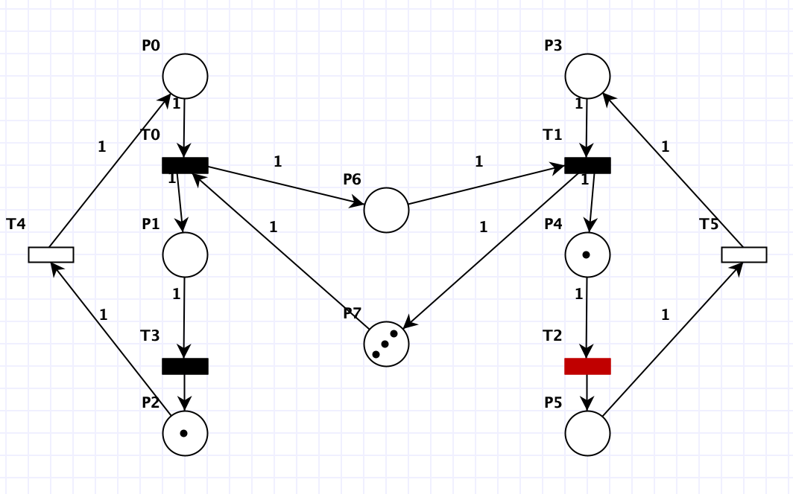

# Sieci Petriego
### **Maciej Makowski**

### 1. Wymyślić własną maszynę stanów, za symulować przykład i dokonać analizy grafu osiągalności oraz niezmienników.

Sieci może osiągać wiele różnych stanów, natomiast żaden token nigdy nie znajdzie się w P2.

#### Graf osiągalności:

S0 {2,0,0}

S1 {1,1,0}

S2 {0,2,0}

Łatwo zauważyć, że tylko jedno miejsce ma zawsze zerową ilość tokenów - P2(nieosiągalny). W pozostałych mogą pojawić się 0, 1 lub 2 tokeny.

#### Niezmienniki:

Trzeba raz nacisnąć T0 i T1, aby wrócić do stanu początkowego tokenów.

Możemy wskazać trzy podzbiory stanów w których suma jest stała:

M(P0) + M(P1) + M(P2) = 2

M(P0) + M(P1) = 2

M(P2) = 0

### 2. Za symulować siec jak poniżej.

#### Graf osiągalności:

Sieć jest nieograniczona, gdyż ilość tokenów stale rośnie(w P3).

Sieć jest żywa, gdyż w każdym momencie możemy wykonać jakieś przejście, świadczy o tym graf osiągalności.

#### Niezmienniki:

Gdyby sieć byłaby odwracalna to analiza niezmienników zwróciłaby ilość przejść potrzebnych, aby wrócić do stanu początkowego. Analiza jest pusta, a więc sieć jest nieodwracalna, co jest zgodne z obserwacjami: w P3 z każdą pętlą przybywa tokenów.

### 3. Za symulować wzajemne wykluczanie dwóch procesów na wspólnym zasobie. Dokonać analizy niezmienników miejsc oraz wyjaśnić znaczenie równań (P-invariant equations). Które równanie pokazuje działanie ochrony sekcji krytycznej?

#### Niezmienniki:

W stanach {P1, P2} i {P3, P4} zawsze jest jeden token. Natomiast pierwsze równanie chroni sekcję krytyczną. Zapewnia, że w stanach {P0, P1, P3} znajdzie się maksymalnie jeden token - maksymalnie jeden proces się w niej znajdzie.

### 4. Uruchomić problem producenta i konsumenta z ograniczonym buforem (można posłużyć się przykładem, menu: file, examples). Dokonać analizy niezmienników. Czy siec jest zachowawcza? Które równanie mówi nam o rozmiarze bufora?

#### Niezmienniki:

O rozmiarze bufora mówi równanie M(P6) + M(P7) = 3 - bufor ma rozmiar 3. 

Sieć jest zachowawcza, ponieważ ilość tokenów jest stała.

### 5. Stworzyć symulacje problemu producenta i konsumenta z nieograniczonym buforem. Dokonać analizy niezmienników. Zaobserwować brak pełnego pokrycia miejsc.

#### Niezmienniki:

Brak ograniczenia rozmiaru bufora.

#### Graf osiągalności:

Brak pełnego pokrycia. Sieć jest nieograniczona, w P6 może stale przybywać tokenów.

### 6. Zasymulować prosty przykład ilustrujący zakleszczenie. Wygenerować graf osiągalności i zaobserwować znakowania, z których nie można wykonać przejść. Zaobserwować właściwości sieci w ”State Space Analysis”.

#### Niezmienniki:

#### Graf osiągalności

Trafiając do S2 nie da się z niego wyjść - deadlock, co potwierdza State Space Analysis.